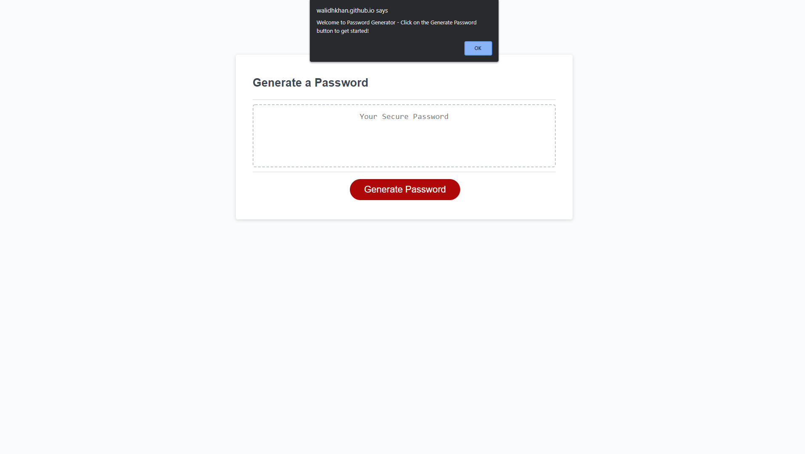

# Password Generator Starter Code
This is a random password generator, built primarily by JavaScript, which prompts the user's desired attributes and generates a random calulated password per the users responses. The prompts ask the user: 
- How many characters they would like their password to be (from 8-128 characters long)
- If they would like their password to contain lowercase letters
- If they would like their password to contain uppercase letters
- If they would like their password to contain numbers
- If they would like their password to contain special characters 

Application Screenshot:

Deployed application URL: https://walidhkhan.github.io/password-generator/
